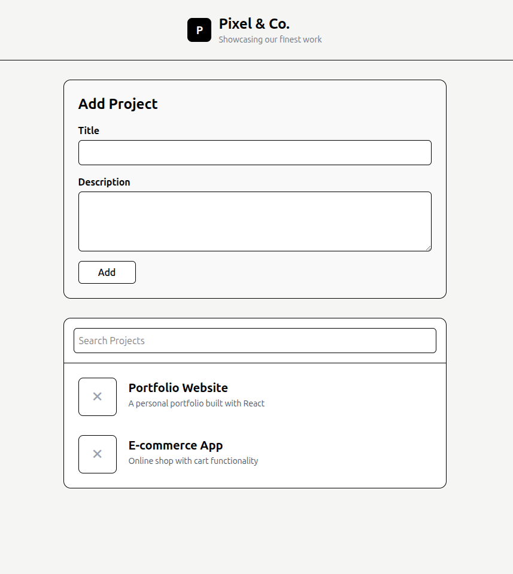

#  Personal Project Showcase App

A modern, responsive web application built for a creative agency to showcase their portfolio of work. Built with React and styled using Tailwind CSS.

---

##  Live Demo

[View Live App](https://your-live-link-here.com)

---

## Screenshot



---

## ✨ Features

- **Project Listing** — Displays all agency projects with title and description
- **Add Projects** — A form to dynamically add new projects to the portfolio
- **Search & Filter** — Live search to filter projects by title
- **Form Validation** — Alerts users when required fields are empty
- **Responsive Design** — Works seamlessly on mobile and desktop

---

## 🛠️ Tech Stack

- [React](https://react.dev/) — UI library
- [Vite](https://vitejs.dev/) — Build tool
- [Tailwind CSS v4](https://tailwindcss.com/) — Styling

---

## 📁 Project Structure

```
src/
├── components/
│   ├── ProjectCard.jsx       # Individual project card
│   ├── ProjectForm.jsx       # Form to add new projects
│   └── DisplayProjects.jsx   # Project list with search
├── App.jsx                   # Root component
├── main.jsx                  # Entry point
└── index.css                 # Global styles / Tailwind import
```

---

## ⚙️ Getting Started

### Prerequisites
- Node.js installed
- npm installed

### Installation

1. Clone the repository
```bash
git clone https://github.com/your-username/your-repo-name.git
```

2. Navigate into the project directory
```bash
cd your-repo-name
```

3. Install dependencies
```bash
npm install
```

4. Start the development server
```bash
npm run dev
```

5. Open your browser and visit `http://localhost:5173`

---

## 👤 Author

**Your Name**  
GitHub: [@your-username](https://github.com/your-username)  
Email: your-email@example.com

---

## 📄 License

This project is open source and available under the [MIT License](LICENSE).